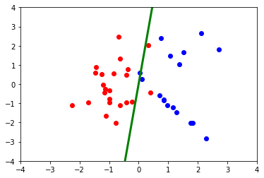
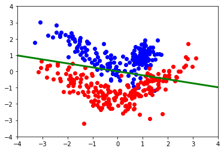

# Отчет по лабораторной работе 1
## по курсу "Машинное обучение"


### Студент: 

| ФИО          | Группа      |
|--------------|-------------|
| Шарапов Л.А. | М8О-308Б-17 |

## Результат проверки

| Преподаватель     | Дата         |  Оценка       |
|-------------------|--------------|---------------|
| Ахмед Самир Халид  |              |               |

## Тема работы

Данные и проблемы в них

## Условие

Необходимо сформировать два набора данных для приложений машинного
обучения. Первый датасет должен представлять из себя табличный набор данных для
задачи классификации. Второй датасет должен быть отличен от первого, и может
представлять из себя набор изображений, корпус документов, другой табличный
датасет или датасет из соревнования Kaggle, предназначенный для решения
интересующей вас задачи машинного обучения. Необходимо провести анализ обоих
наборов данных, поставить решаемую вами задачу, определить признаки необходимые
для решения задачи, в случае необходимости заняться генерацией новых признаков,
устранением проблем в данных, визуализировать распределение и зависимость
целевого признака от выбранных признаков. В отчете описать все проблемы, с
которыми вы столкнулись и выбранные подходы к их решению.

## Подготовка данных


Для создания наборов данных используется функция make_classification из библиотеки sklearn. 
Первый из них имеет размер 50, а второй — 500. 
Они состоят из двух значимых особенностей. 
Например, координатами по осям OX и OY двух враждующих сторон. 

```python
from sklearn.datasets import make_classification

size1 = 50  # Размер первой выборки
size2 = 500 # Размер второй выборки

# Первый и второй наборы данных состоят из
# 2-х особенностей (n_features)
# 2-х значимых особенностей (n_informative) из всех (n_features). Например, размер опухоли и ее возраст
# Следовательно, 0 избыточных и дублирующих особенностей (n_reduntant и n_repeated, соответственно)
# 0 дублирующих особенностей (n_repeated),
# так как n_informative + n_redundant + n_repeated <= n_features

# Нулевая доля выборок, класс которых обменивается случайным образом (flip_y)

X1, T1 = make_classification(n_samples = size1, n_features=2,
                           n_redundant=0, n_informative=2, flip_y=0)

X2, T2 = make_classification(n_samples = size2, n_features=2,
                           n_redundant=0, n_informative=2, flip_y=0)
                           
# Где
# X1 и X2 - первая и вторая выборки (датасеты)
# T1 и T2 - метки (классы), первого и второго наборов данных, соответственно
```

Приводятся значения элементов множества меток к величинам 1 и -1

```python
T1 = T1*2-1
T2 = T2*2-1
```

Наборы данных разделяются на обучающие и тестовые в пропорции 80:20

```python
import numpy as np

split_size = 0.8

train_size1 = int(len(X1)*split_size)
test_size1 = len(X1) - train_size1

train_size2 = int(len(X2)*split_size)
test_size2 = len(X2) - train_size2

train_x1 = np.copy(X1[0:train_size1])
train_t1 = np.copy(T1[0:train_size1])

train_x2 = np.copy(X2[0:train_size2])
train_t2 = np.copy(T2[0:train_size2])
```

## Описание нейросети

Для решения задачи классификации выбрана математическая модель нейрона.

## Обучение нейросети

Для обучения нейросети нужно подобрать веса, минимизировав критерий персептрона. 
Выбран метод градиентного спуска.

```python
def gradientDescentMethod(X, T):
    num_features = X.shape[1] # Размер обучающей выборки
    weights = np.zeros(num_features) # Инициализируем веса нулями
    h = 1 # Постоянный шаг
    
    for i in range(X.shape[0]):
        z = np.dot(weights,X[i]) # Произведение матриц весов и X_i = ||X_ij||, где i = 1,...n, j = 1,...k,
        if(((z>=0) and (T[i]<0)) or ((z<0) and (T[i]>0))): # Если точка выше прямой (1 класс) и имеет 2 класс, то внести в критерий персептрона и наоборот
            weights = weights + h*X[i]*T[i]
            
    return weights
```

Если точка из обучающей выборки классифицирована неправильно, то она добавляется в критерий персептрона для нахождения итогового веса методом градиентного спуска.

Получаем веса для обоих обучающих выборок

```python
wts1 = gradientDescentMethod(train_x1, train_t1)
wts2 = gradientDescentMethod(train_x2, train_t2)
```

## Отображение графиков функции

Инициализируется функция

```python
import pylab

def functionGraphCreation(train_x, train_t, weights):
    first_features = np.array([ [t[0],t[1]] for i,t in enumerate(train_x) 
                          if train_t[i]>0])
    second_features = np.array([ [t[0],t[1]] for i,t in enumerate(train_x) 
                          if train_t[i]<0])
    x = np.array([-8, 8], dtype='float32')
    y = -(weights[0] * x)/weights[1]
    pylab.xlim(-4, 4)
    pylab.ylim(-4, 4) 
    pylab.plot(first_features[:,0], first_features[:,1], 'bo')
    pylab.plot(second_features[:,0], second_features[:,1], 'ro')
    pylab.plot(x, y, 'g', linewidth=3.0)
    pylab.show()
```

Отображаются графики






## Выводы

Для минимизации критерия персептрона можно использовать разные методы оптимизации. Поскольку функция имеет количество аргументов, равное числу особенностей набора данных, то ее график в некоторых случаях сложно изобразить, поэтому выбраны 2 особенности и 1 нейрон. 
Это позволяется представить функцию в виде 0 = W_1x2 * X_2x1 = (w_1 w_2)*(x_1 x_2)^T = w_1 * x_1 + w_2 * x_2. 
Следовательно, если при текущих весах и выбранной точке функция W_1x2 * X_2x1 больше 0, то она определяет точку, как принадлежащую первому классу, а если меньше 0, то - второму. 
При неправильном определении точки веса должны корректироваться, то есть ее нужно добавить в критерий персептрона. 

